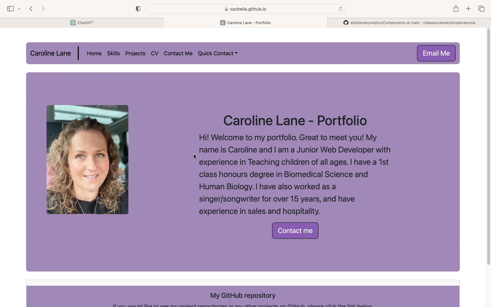
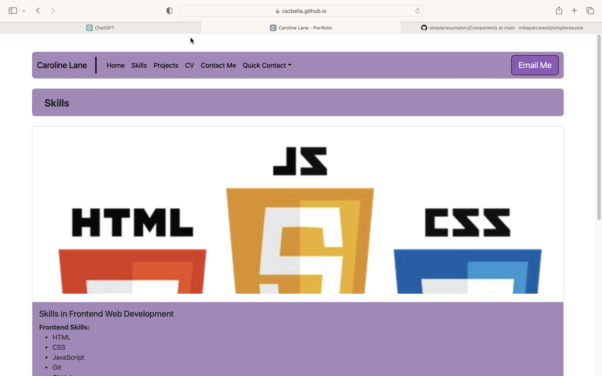
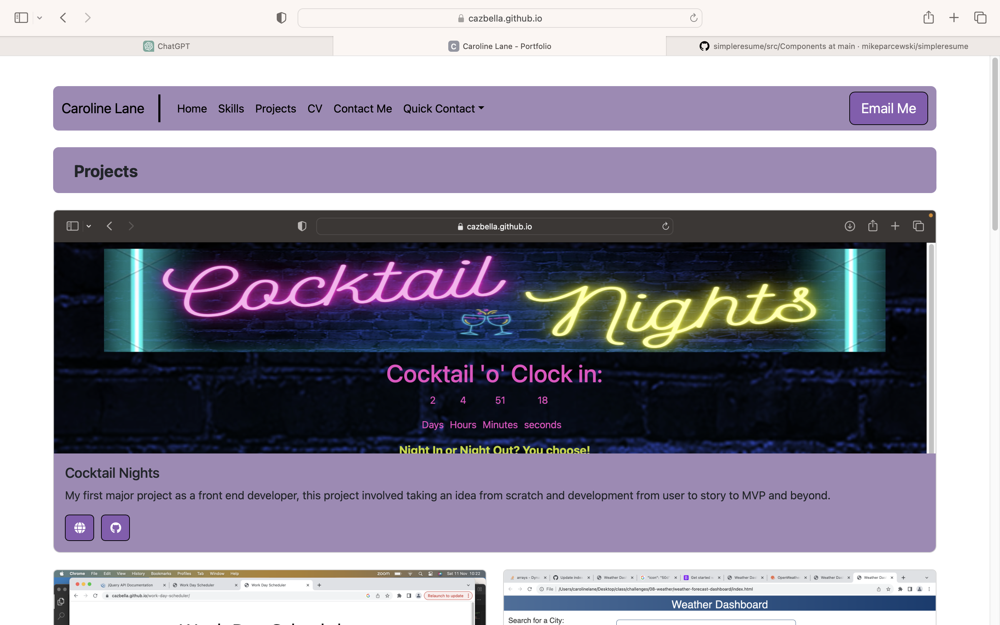
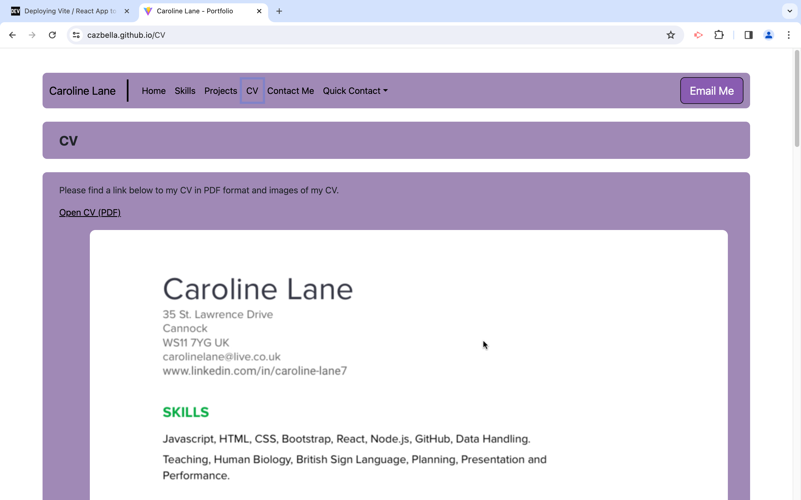
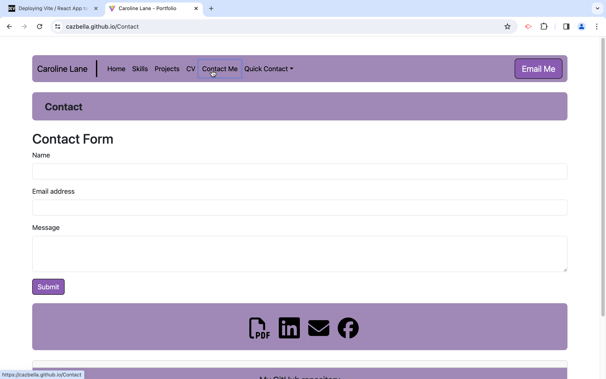

  # React Portfolio

### Contact Information
- **GitHub:** [Cazbella](https://github.com/Cazbella)
- **Email:** cazbella@myyahoo.co.uk

## Table of Contents
- [Description](#description)
- [Installation](#installation)
- [Usage](#usage)
- [Contributing](#contributing)
- [Questions](#questions)

## Description

Find the deployed application here: 

https://cazbella.github.io/react-portfolio/

Welcome to my React Portfolio! This project serves as a showcase of my skills, projects, and experiences in a visually appealing and interactive way. Built using React, this portfolio provides a dynamic and responsive user interface to explore my professional journey. My motivation for this project is to showcase my skills so far in Web Development.

Features:
- Responsive Design: The portfolio is designed to be accessible and visually appealing across various devices and screen sizes.
- Skills - A comprehensive list of the skills I have gained so far as a front end developer.
- Project Showcase: A dedicated section highlights key projects, each with detailed information, images, and links to the deployed application and repositories.
- CV - A copy of my CV and a link to a PDF version.
- Contact Form: Allows visitors to get in touch with me easily through a contact form. The logic to send data to a server is not present (yet), but you can see in the console that the state is changed and data is set. This page also includes another link to the CV as well as links to my email address, linked-in and Facebook profiles in order to ontact me via these methods. 

### Challenges

Getting started with this project was TOUGH! This was because it was so very different to other projects I have done. Using react is very involved and takes a lot of getting used to. Linking all the files and installing dependencies took a lot of time. As usual, CSS took me hours but I am pleased with the results. Deploying it to GitHub Pages was also a challenge. I have learned that everything must be imported and exported before the application will work, and there are many interacting things that could go wrong!

### Credit

I had help from my tutor and ask BCS for this challenge. I also used Stack Overflow extensively, as well as the React, Bootstrap and FontAwesome docs. I also used lots of code examples from the lessons this week. 

## Installation
Installation:
1. Clone the repository: git clone https://github.com/cazbella/react-portfolio.git
2. Navigate to the project directory: cd react-portfolio
3. Install dependencies: npm install
4. Start the development server: npm start

Visit http://localhost:3000 to view the app in your browser.

**Dependencies:**
- `@fortawesome/fontawesome-free`: ^6.5.1
- `@fortawesome/fontawesome-svg-core`: ^6.5.1
- `@fortawesome/free-brands-svg-icons`: ^6.5.1
- `@fortawesome/free-solid-svg-icons`: ^6.5.1
- `@fortawesome/react-fontawesome`: ^0.2.0
- `@popperjs/core`: ^2.11.8
- `bootstrap`: ^5.3.2
- `react`: ^18.2.0
- `react-dom`: ^18.2.0
- `react-router-dom`: ^6.10.0

**DevDependencies:**
- `@types/react`: ^18.2.43
- `@types/react-dom`: ^18.2.17
- `@vitejs/plugin-react`: ^4.2.1
- `eslint`: ^8.55.0
- `eslint-plugin-react`: ^7.33.2
- `eslint-plugin-react-hooks`: ^4.6.0
- `eslint-plugin-react-refresh`: ^0.4.5
- `vite`: ^5.0.10

## Usage

Upon loading you can click on 'Home' and see the home page, as shown below. 

Use the buttons in the navigation bar to explore the pages, as shown in the below images.

My Skills...

My Projects...

My CV

And finally a Contact page

This page also has a link to my CV in PDF format. 

## Contributing
Contributions to this project are welcome and encouraged! If you have ideas for new features, find a bug, or want to improve the documentation, feel free to contribute. To contribute to the project fork the repository on GitHub. Clone your forked repository to your local machine. Create a new branch with a descriptive name for your contribution: git checkout -b feature/new-feature or git checkout -b bug/fix-bug. Then make your changes and commit them with a clear message. Push your changes to your forked repository and open a pull request in the main repository with a detailed description of your changes. Please follow the project's coding style and adhere to the existing conventions. By contributing, you agree that your contributions will be licensed under the project's license. Thank you for helping make my portfolio better!
